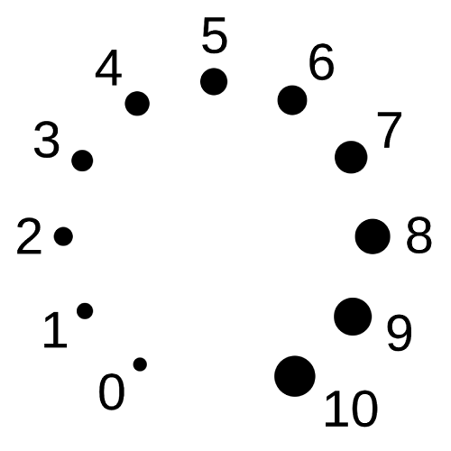

# AUDIO EFFECTS DATASET

---
## Dry Inputs

Available here: [https://zenodo.org/uploads/10455730](https://zenodo.org/uploads/10455730)

Dry inputs are a selection of clean guitar and bass recordings from several sources:

- [IDMT-SMT-GUITAR](https://www.idmt.fraunhofer.de/en/publications/datasets/guitar.html) - dataset 2 (7:23 min)
- [IDMT-SMT-GUITAR](https://www.idmt.fraunhofer.de/en/publications/datasets/guitar.html) - dataset 4 - Career SG (6:08 min)
- [IDMT-SMT-GUITAR](https://www.idmt.fraunhofer.de/en/publications/datasets/guitar.html) - dataset 4 - Ibanez 2820 (5:14 min)
- [IDMT-SMT-Bass-Single-Track](https://www.idmt.fraunhofer.de/en/publications/datasets/bass_lines.html) - (5:58 min)
- [NAM: Neural Amp Modeler](https://github.com/sdatkinson/neural-amp-modeler?tab=readme-ov-file#download-audio-files) - (3:11 min)
- Private Guitar Data - (5:19 min)
- YouTube Bass Recordings - (10:09 min)

Pre-processing:

- All:
  - synchronization markers (2 impulses) added at start and end of every file
- IDMT-SMT-GUITAR - dataset 2:
  - peak normalized to -6dBFS
- NAM:
  - no pre-processing
- Others:
  - peak normalized to -0.1dBFS
  - signal multiplied by random number every 5 seconds (uniform distribution [0.1, 1.0] = [-20dB, 0dB])

---
## External Data

This repo contains also links to external sources (i.e., data recorded by others for scientific publication purposes or personal projects). In these cases the dry inputs will be different from the ones described above and will have a separate link for download.

Attributions to the original authors are included in this repo and references to publication, code, webpage etc. are included in a README file.

---
## Controls

Controls are expressed in a range from 0 to 10, corresponding to the positions shown below. If you are contributing to this dataset please follow this convention.



---
## Analog Effects

### Amplifier/Preamp
- [Blackstar HT1 - Channel: Overdrive](https://zenodo.org/uploads/10794425) - [1]
- [Blackstar HT5 Metal - Channel: Overdrive](https://zenodo.org/uploads/10796501) - [2] 
- [Engl Retro Tube 50 - Channel: Drive](https://zenodo.org/uploads/10796525) - [2]
- [Fender Blues Jr](https://zenodo.org/uploads/10797977) - [3]
- [Ibanez TSA15 - Channel: Crunch](https://zenodo.org/uploads/10796536) - [2]
- [MesaBoogie 550 - Channel: Clean](https://zenodo.org/uploads/10796557) - [2]
- [MesaBoogie 550 - Channel: Crunch](https://zenodo.org/uploads/10796819) - [2]
- [MesaBoogie 550 - Channel: Burn](https://zenodo.org/uploads/10796547) - [2]
- [MesaBoogie Mark V - Channel: Clean](https://zenodo.org/uploads/10796829) - [2]
- [MesaBoogie Mark V - Channel: Crunch](https://zenodo.org/uploads/10796841) - [2]
- [MesaBoogie Mark V - Channel: Extreme](https://zenodo.org/uploads/10796864) - [2]
- [Universal Audio 6176 Vintage Channel Strip - 610B Mic Preamp](https://zenodo.org/uploads/10798111) - [4]
 
### Chorus
- [Landlord Brewers Droop Chorus](https://zenodo.org/uploads/10796408)

### Compressor/Limiter
- [Ampeg Optocomp](https://zenodo.org/uploads/10465454)
- [Flamma Analog Comp](https://zenodo.org/uploads/10794703)
- [Yuer Dyna Compressor](https://zenodo.org/uploads/10796426) (similar to Ross Compressor)
- [Universal Audio 6176 Vintage Channel Strip - 1176LN Limiter](https://zenodo.org/uploads/10798151) - [4]


### Overdrive
- [DIY Klon Centaur](https://zenodo.org/uploads/10797932) - [3]
- [Fulltone Full Drive 2](https://zenodo.org/uploads/10794615)
- [Ibanez TS9](https://zenodo.org/uploads/10797988) - [3]
- [Harley Benton Green Tint](https://zenodo.org/uploads/10796333) (similar to Ibanez Tube Screamer)

### Distortion
- [DIY Electro Harmonix Big Muff](https://zenodo.org/uploads/10797916) - [3]
- [Electro Harmonix Metal Muff](https://zenodo.org/uploads/10794659)
- [Harley Benton Big Fur](https://zenodo.org/uploads/10794737) (similar to Electro Harmonix Big Muff)
- [Harley Benton Drop Kick](https://zenodo.org/uploads/10794776) (similar to Suhr Riot)
- [Harley Benton Plexicon](https://zenodo.org/uploads/10796359)
- [Harley Benton Rodent](https://zenodo.org/uploads/10796378) (similar to Proco Rat)

### Fuzz
- [Harley Benton Fuzzy Logic](https://zenodo.org/uploads/10796322) (similar to Fuzz Face Germanium)
- [Harley Benton Silly Fuzz](https://zenodo.org/uploads/10796394) (similar to Fuzz Face Silicon)

### Tremolo
- [Mooer Trelicopter](https://zenodo.org/uploads/10796416)

---
## Digital Effects

---
## Sources

[1] - [https://github.com/Alec-Wright/Automated-GuitarAmpModelling](https://github.com/Alec-Wright/Automated-GuitarAmpModelling)\
[2] - [https://github.com/TSchmitzULG/NeuralNetwork_Comparison/tree/master](https://github.com/TSchmitzULG/NeuralNetwork_Comparison/tree/master)\
[3] - [https://github.com/GuitarML](https://github.com/GuitarML)
[4] - [https://github.com/mchijmma/DL-AFx](https://github.com/mchijmma/DL-AFx)

---
## References

If you make use of AUDIO EFFECTS DATASET, please cite the following publication:

```
@article{TBD}
```
